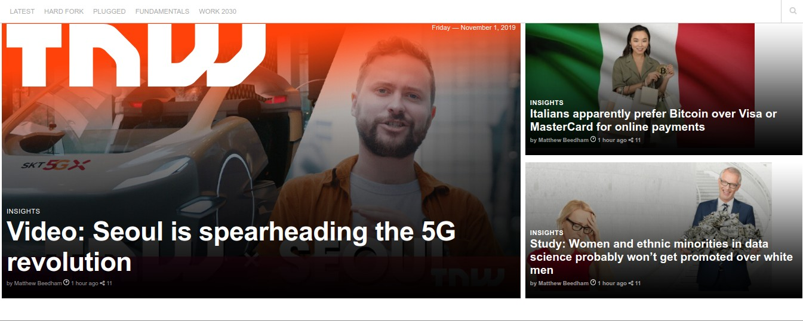

# next-web

Clone of The Next Web - Responsive Website

## Table of Contents

* [About the Project](#about-the-project)
  * [Built With](#built-with)
* [Contributing](#contributing)
* [Contact](#contact)
* [Acknowledgements](#acknowledgements)

<!-- ABOUT THE PROJECT -->
## About The Project

URL to the live version of our project: [TNW Clone](https://rawcdn.githack.com/ermin-cahtarevic/next-web/58627029f105d56acb7af3b76d902d8a6695b74c/index.html)

This a rebuild of The Next Web responsive website. The page we use for reference is [TNW](https://thenextweb.com/)

### Built With

* [HTML](https://github.com/ermin-cahtarevic/next-web/blob/developer-branch/index.html)
* [CSS](https://github.com/ermin-cahtarevic/next-web/blob/developer-branch/style.css)

## Contributing

Contributions are what make the open source community such an amazing place to be learn, inspire, and create. Any contributions you make are **greatly appreciated**.

1. Fork the Project
2. Create your Feature Branch (`git checkout -b feature/AmazingFeature`)
3. Commit your Changes (`git commit -m 'Add some AmazingFeature'`)
4. Push to the Branch (`git push origin feature/AmazingFeature`)
5. Open a Pull Request

<!-- CONTACT -->
## Contact

Melissa Castorena - mcastorena0316@gmail.com

Ermin Cahtarevic - erminc@windowslive.com

Project Link: [The Next Web](https://github.com/ermin-cahtarevic/next-web/tree/developer-branch)

<!-- ACKNOWLEDGEMENTS -->
## Acknowledgements

* [Microverse](https://www.microverse.org/)
* [The Next Web](https://thenextweb.com/)

